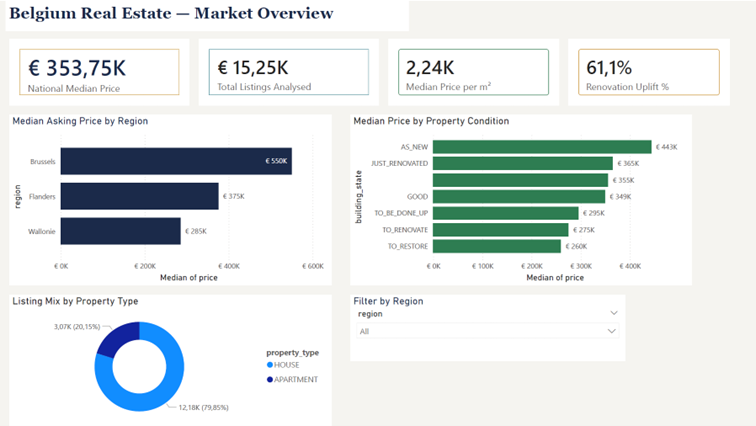
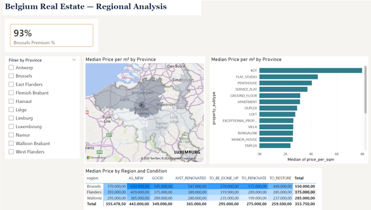
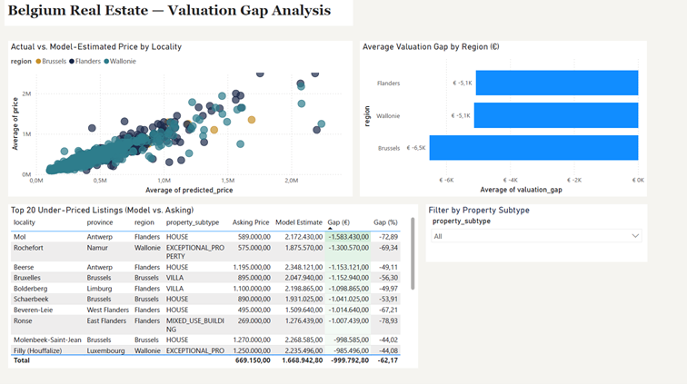

# Belgium Real Estate, Property Valuation Intelligence

### A fast screen on what a Belgian listing should sell for

A fair-value model over 15.254 Belgian residential listings from Immoweb that flags likely over- and under-priced homes, so an investor or agency can shortlist what is worth a closer look before anyone drives out for a viewing. It is a first-pass screening tool, not an appraisal, and the README is explicit about that limit. Includes a regional market study and a print-ready executive report.

## Project summary

Belgian residential prices vary widely across regions, property types, and conditions, and buyers have no systematic way to tell a fair listing from an inflated one. This project builds a valuation model and a market analysis that let investors and agencies identify mispriced listings at scale.

**Core question:** which combination of region, property type, size, and condition drives price per square metre, and can a model predict fair market value well enough to flag mispriced listings?

## Key findings

| Metric | Value |
|---|---|
| National median listing price | EUR 353.750 |
| Brussels median price per m2 | EUR 3.333 |
| Brussels median price vs Wallonie | +93% (EUR 550.000 vs EUR 285.000) |
| Brussels price per m2 vs Wallonie | +88% (EUR 3.333 vs EUR 1.777) |
| Renovation uplift (AS_NEW vs TO_RENOVATE) | +61% (EUR 168.000) |
| Buy-renovate-sell ROI (Flanders scenario) | 9,6% (EUR 38.325 net profit) |

Living area is the strongest single price driver, explaining 58,2% of model variance, ahead of region (8,8%) and property subtype (5,3%).

## Model purpose

The model estimates the fair market value of a residential property from its location, size, type, and condition, so investors and agencies can identify over- and under-priced listings relative to comparable properties.

## Repository structure

The repository is kept flat: every deliverable sits in the root, with screenshots in one subfolder. With six files, a flat layout lets a reviewer see the full scope on the repository landing page without clicking through folders.

```
belgium_re_pipeline.py             Python pipeline: cleaning, EDA, ML, exports
belgium_re_executive_report.html   A4 executive report (3 pages, print-ready)
belgium_re_powerbi.pbix            Power BI dashboard (open in Power BI Desktop)
belgium_re_powerbi_export.csv      Cleaned, enriched Power BI dataset (23 columns)
belgium_re_feature_importance.csv  Random Forest feature importance scores
screenshots/                       Dashboard and report preview images
README.md
.gitignore
```

## Dashboard preview

### Page 1, Market Overview


### Page 2, Regional Analysis


### Page 3, Valuation Gap (Opportunity Finder)


### Executive Report, Cover Page


## Deliverables

### 1. Python pipeline (`belgium_re_pipeline.py`)
Loads the raw Immoweb file, audits and cleans it, engineers features, trains a Random Forest regressor, runs the renovation ROI scenario, and writes both export CSVs. It runs from the folder that holds the raw data file, with no path edits required.

```
pip install pandas numpy scikit-learn openpyxl
python belgium_re_pipeline.py
```

### 2. Executive report (`belgium_re_executive_report.html`)
A4 print-ready, three pages:
- Page 1: four business-facing KPI tiles
- Page 2: executive summary, findings, and recommendations with quantified impact
- Page 3: data quality log, ML methodology, and a full ROI assumption log

Print settings: margins None, scale 100%, background graphics on.

### 3. Power BI dashboard and export (`belgium_re_powerbi.pbix`, `belgium_re_powerbi_export.csv`)
The `.pbix` opens directly in Power BI Desktop. It reads the export CSV, which is the cleaned, feature-engineered dataset produced by the pipeline, not raw data. Derived columns:

| Column | Description |
|---|---|
| `price_per_sqm` | price divided by living_area (EUR per m2) |
| `predicted_price` | Random Forest estimate of fair market value |
| `valuation_gap` | actual price minus predicted price (positive signals overpricing) |
| `valuation_gap_pct` | valuation_gap as a percentage of predicted_price |
| `kitchen_score` | ordinal, 0 (not installed) to 3 (hyper equipped) |
| `building_score` | ordinal, 0 (to restore) to 5 (as new) |

### 4. Feature importance (`belgium_re_feature_importance.csv`)
Random Forest importances for the 12 model inputs, used as the source for the methodology bar chart.

## Data quality summary

| Issue | Records | Treatment |
|---|---|---|
| Duplicate URLs (same listing scraped twice) | 2.821 | Deduplicated; prices identical, first kept |
| Corrupted living_area values | 1.636 | Set to NaN; scraper artefact |
| surface_land = 'UNKNOWN' | 2.385 | Set to NaN; informational only, not a model feature |
| Missing price | 498 | Excluded; target variable |
| Missing region | 121 | Excluded; key predictor |
| Price outliers (below p1 or above p99) | ~305 | Excluded; non-residential |
| living_area > 2.000 m2 | 8 | Excluded; implausible for residential |
| number_rooms > 15 | 94 | Capped at 15; data entry errors |

**Final clean dataset:** 15.254 listings, 3 regions, 11 provinces, 23 property subtypes.

## Model performance

- Algorithm: Random Forest Regressor, 200 trees
- Train/test split: 80/20 (random_state = 42)
- R2: 0,635, MAE: EUR 128.858, MAPE: 30,9%

An R2 of 0,635 means the model explains 63,5% of price variation from publicly observable listing attributes. Unobserved factors, such as micro-location quality, interior finish, views, and floor level, account for the rest. That is the expected ceiling for a model trained on listing metadata alone, without a physical inspection.

## ROI scenario model

**Scenario:** buy a TO_RENOVATE property in Flanders, renovate it, and resell at the AS_NEW median.

| Input | Value | Source |
|---|---|---|
| Purchase price | EUR 289.000 | From data (Flanders TO_RENOVATE median) |
| Renovation cost | EUR 90.000 | Assumed: EUR 600/m2 x 150 m2 |
| Transaction costs | EUR 21.675 | Assumed: 7,5% of purchase price |
| Total investment | EUR 400.675 | Sum of the above |
| Resale price | EUR 439.000 | From data (Flanders AS_NEW median) |
| **Net profit** | **EUR 38.325** | Resale minus total investment |
| **ROI** | **9,6%** | Net profit divided by total investment |

The pipeline, this README, and the executive report use the same assumptions, so all three reconcile to the same figures.

## Methodology notes

- **Data source:** Immoweb, Belgium's largest property portal, publicly scraped listing data.
- **Scope:** residential properties. Mixed-use and apartment-block listings are retained where they appear in the residential search results under HOUSE-type categories.
- **Price definition:** asking price as listed, with no adjustment for negotiation margin.
- **Number format:** Dutch locale, a period (.) separates thousands and a comma (,) marks the decimal (for example EUR 353.750 and EUR 2.237,40/m2).
- **Excluded from version control:** the raw source file, Python bytecode, virtual environments, notebooks, and OS metadata. See `.gitignore`.

## About

**Ying Zhao**, BI &amp; Data Analyst for commercial and supply-chain teams. Antwerp on-site, Belgium remote.

Eight years on the commercial side (a EUR 2M client book at 95% retention) before I built the analytics, so I read data the way an owner reads a P&L: start from the decision, then build the SQL and the model that move it.

Tools: Python (pandas, scikit-learn), SQL, Power BI, Excel, Git.

- Portfolio: [ying-data.github.io/portfolio](https://ying-data.github.io/portfolio/)
- LinkedIn: [weiying-zhao](https://www.linkedin.com/in/weiying-zhao/)
- Email: [weiying.data@gmail.com](mailto:weiying.data@gmail.com)
